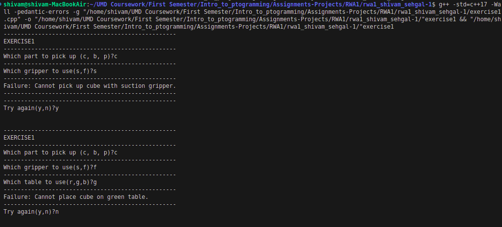
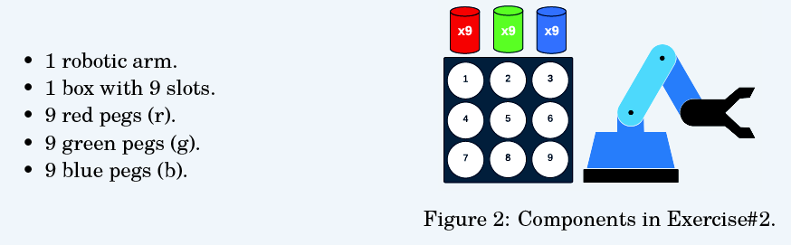

# Robotic Arm Pick-and-Place System Readme

## Introduction

This program simulates a robotic arm pick-and-place system, where a robotic arm can pick up various objects and place them on different tables. The system involves 1 robotic arm, 3 types of objects (cube, ball, and peg), 2 types of grippers (suction and finger gripper), and 3 tables (red, green, and blue).

## Functionality

The program follows specific rules for picking and placing objects:

1. The arm can only pick up the ball with the suction gripper.
2. The arm can only pick up the cube and the peg with the finger gripper.
3. The cube can be placed only on the red table, the ball only on the green table, and the peg only on the blue table.

## How to Use the Program

To use the program, follow these steps:

1. **Select Object to Pick Up:**
   - You will be prompted to enter the object you want the robotic arm to pick up. You can choose from "cube," "ball," or "peg."

2. **Choose Gripper Type:**
   - After selecting the object, you will be asked to choose the gripper type to use. You can select from "suction" or "finger gripper" based on the rules mentioned earlier.

3. **Specify Table for Placement:**
   - Lastly, you need to specify the table where you want the object to be placed. You can choose from "red," "green," or "blue" based on the rules mentioned earlier.

## Program Output

Based on your inputs, the program will provide one of the following messages:

- If your choices comply with the rules, the program will display a success message. For example: "Pick up the ball with the suction gripper and place it on the green table: Success."

- If your choices violate the rules, the program will display a failure message. For example: "Pick up the cube with the suction gripper and place it on the green table: Failure (Gripper and Object Mismatch)."

## Example Use Cases

Here are a few example scenarios to illustrate how the program works:

- **Scenario 1 (Success):** You choose to pick up the ball with the suction gripper and place it on the green table. The program will respond with a success message.

- **Scenario 2 (Failure):** You choose to pick up the cube with the suction gripper and place it on the green table. The program will respond with a failure message since the gripper and object do not match.

- **Scenario 3 (Failure):** You choose to pick up the peg with the finger gripper and place it on the red table. The program will respond with a failure message since the object and table do not match.

### Sample code output

## Conclusion

This program allows users to interact with a simulated robotic arm pick-and-place system while ensuring that the rules governing object manipulation are followed. Users can experiment with different combinations and receive feedback on the success or failure of their choices.

# Peg Placement Robot Program Readme

## Introduction

This program simulates a robotic arm that places pegs in slots within a box based on user inputs. The environment consists of 1 robotic arm, a box with 9 slots, and three types of pegs (red, green, and blue). The goal is to allow the user to specify which pegs to place in the slots and visualize the status of the slots.

## Program Logic

The program follows these key points and logic:

1. **Peg Selection**: The user is prompted to enter whether they want the robot to place pegs of a given color (red, green, or blue). If the user enters 'y,' the program asks for the slots where the pegs should be placed. If the user enters 'n,' the program skips the question about the slots.

2. **Dynamic Slot Selection**: The question about slot selections is dynamic. For instance, when initially prompted for slot selection, all slots are available, and the program proposes the range of slots to choose from. As selections are made, available slots are updated based on user choices.

3. **Slot Status Display**: After each input related to peg placement, the program displays the status of the slots. Unoccupied slots are numbered, and occupied slots are represented with letters ('r' for red pegs, 'g' for green pegs, and 'b' for blue pegs).

4. **Try Again Option**: Once all selections are made, the program prompts the user if they want to try again. If the user enters 'y,' the program restarts, allowing the user to make new selections. If the user enters 'n,' the program exits.

## Program Implementation

The program uses a 2D array implemented with `std::array` to keep track of available and occupied slots. This 2D array is a local variable within the `main()` function, not a global variable. The array is updated each time the user makes a selection, and slot information is displayed in a structured manner using loops.

## Example Usage

The program is interactive and allows users to choose which pegs to place in which slots. Here's a simplified example of how it might work:

1. The user is asked if they want to place red pegs. If they choose 'y,' they are prompted to enter slot numbers for red pegs.

2. After each selection, the program updates the slot status, displaying the chosen pegs in their respective slots.

3. The process continues for green and blue pegs.

4. After all selections, the program asks if the user wants to try again.

## Conclusion

This program allows users to interact with a simulated robotic arm that places pegs in slots within a box. Users can experiment with different peg placements and see the status of the slots dynamically updated as they make their choices. The option to start a new round provides flexibility for further experimentation.

